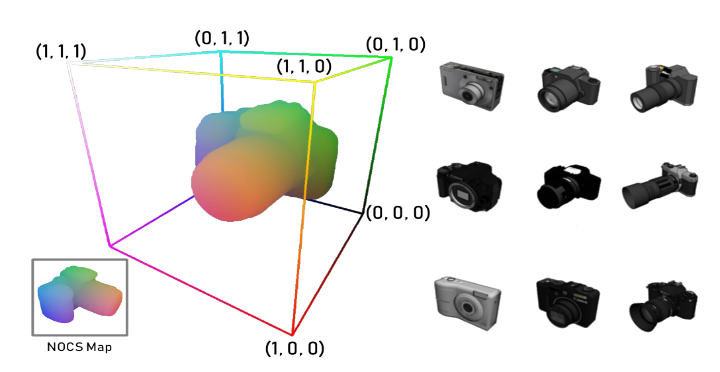
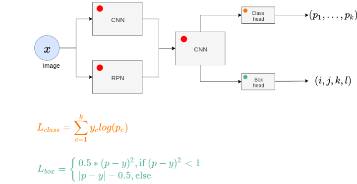
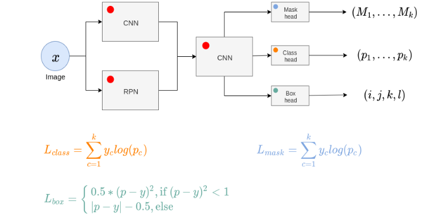
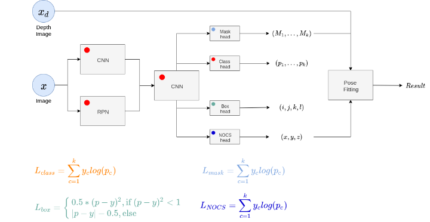
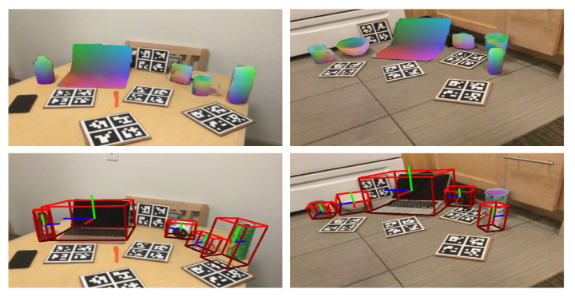
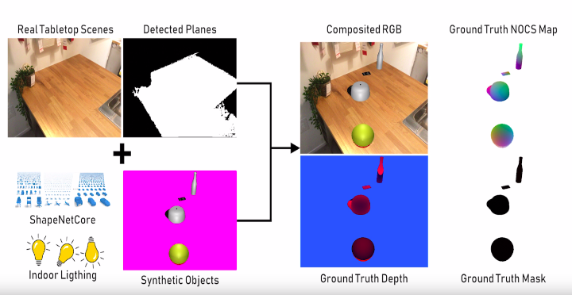
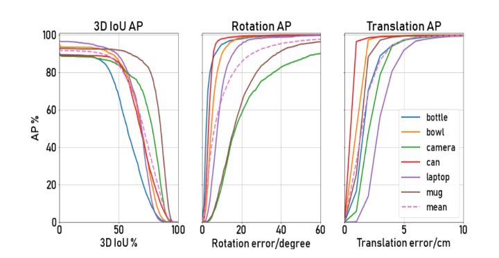
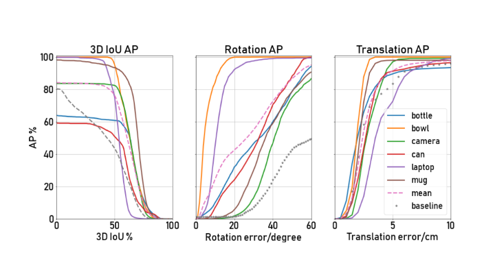
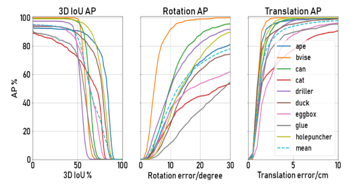
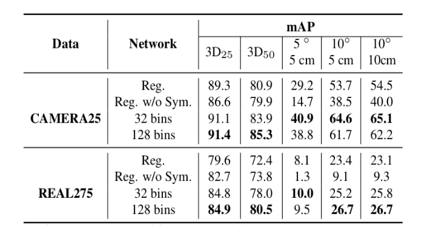

# Normalized Object Coordinate Space for Category-Level 6D Object Pose and Size Estimation

## Basic definitions

Before we go to the content of the paper itself, there might be some definitions and principles that might be useful when reading the article:

* [6D pose](https://en.wikipedia.org/wiki/Pose_(computer_vision))
* [Depth image](https://en.wikipedia.org/wiki/Depth_map)
* [CAD model](https://de.wikipedia.org/wiki/CAD)

## Introduction

Estimating 6D pose of objects has been always an interesting and challenging task for many applications in such spheres as robotics, augmented reality and 3D scene understanding. For instance, when a robot wants to grasp a box, it's necessary for him to know what rotation and translation does it have w.r.t. to him in order to adjust his hand properly. Another example is when we want to understand what's going on on the image containing a group of people. If we have estimates of theirs 6D poses we can make a better guess what exactly are the doing.

In this article we'll have a look at one possible approach to estimate 6D poses of objects from particular categories (category-level) using only a 3D image.

## Related Work

The authors of the paper propose not only an effective model for estimating the pose, but also a new way to construct a training dataset. However, in order to understand what's special and new in their approach we need to have a quick look at related problems and their solutions.

**Category-Level 3D Object Detection.** In this problem the main objective is to estimate the bounding box around objects from certain categories using a 3D image. There are two main branches how people solved this problem:

* Directly work with volumetric data [1, 2]. The high-level idea behind this approach is to convert the whole CAD model to the 3D point cloud and work with some regions of it to predict the coordinates of the bounding box and the object class which a particular region contains
* Use 2D object proposals to infer the bounding box [3, 4, 5, 6]. The intuition behind this approach is to construct 3D [image segmentation](https://blog.playment.io/semantic-segmentation/) out of 2D segmented images. Since for 2D there exist lots of models which already give good results they're used to extend it to a much more difficult to segment directly 3D space

***Difference.*** As you might have already seen, the problem of estimating 3D bounding box is just a sub-problem which the authors have solved (to a certain extent) in this work.

**Instance-Level 6D Pose Estimation.** This problem statement means that we're are not bounded to any categories. We predict 6D pose of *all* the objects no matter to which class they belong which are present on a given image. The two main approaches to solve this problem are:

* Template matching approach [7, 8, 9, 10]. The intuition is to get the 3D point clouds of the objects in the image and after that to match CAD models of the corresponding objects to them. After matching, it's easy to see what translation and rotation were applied to a given CAD model to be matched to the 3D point cloud
* Coordinates regression [11, 12, 13]. In this branch, the idea is to directly predict the object surface position corresponding to each object pixel

***Difference.*** Both of the above-mentioned approaches require CAD models for all unseen objects during test and train time. Storing the models for all unseen objects during test time is infeasible.

**Category-Level 4D Pose Estimation.** For this problem, only translation and rotation along a normal axis are predicted. For example, in [4] 4D poses of indoor furniture were estimated. It's clear that a chair or a table can't be on the ceiling and that they always stand on the floor. Consequently, predicting rotation along the floor is enough to solve the task of pose estimation.

***Difference.*** While for estimating pose of indoor furniture 4D pose estimation is enough, in real life there are many cases when objects can be anywhere in space and there is no normal axis. For such cases, 4D pose estimation is not enough.

**Training Data Generation.** Generating data for pose estimation is a quite tedious and expensive task. There are two major approaches to solve it:

* Manual data generation [14, 15, 16]. There's a series of works where researchers tried to generate and label data manually, but the datasets are relatively small
* Synthetic data generation [17, 18, 19, 20]. Several attempts were made to generate synthetic scenes and put synthetic objects on them. However, for the sake of simplicity the scenes were lacking important details such as color, texture and proper objects distribution

***Difference.*** In this approach, the authors propose a method for generating synthetic training data   considering real scenes and inserting synthetic objects in a more "realistic" places on the image. Moreover, the authors are focusing more on classes of smaller objects like mugs or laptops.

## Method

As summary, we want to estimate 6D pose of objects from a fixed set of categories and we have no CAD models for unseen objects during test time. For unseen objects 6D pose is not well-defined and to add we need some way to represent it.

### Normalized Object Coordinate Space (NOCS)
NOCS is a 3D space contained withing a unit cube (each coordinate is between zero and one). For each of categories a separate NOCS space is defined. CAD model of each object of each categories (remember, we don't have CAD models only for unseen objects during test time!) is normalized such that its diagonal is equal to one and all the objects withing each categories are rotated in a same way.

This is how an object from camera category looks like in NOCS space (here and further we'll set axis in NOCS space to represent RGB values):

 

Fig. 1, He Wang, Srinath Sridhar, Jingwei Huang, Julien Valentin, Shuran Song, Leonidas J. Guibas,Normalized Object Coordinate Space for Category-Level 6D Object Pose and Size Estimation, CVPR 19

 

### Network Architecture
The pose is estimated with the help of a neural network. However, in order to better understand how exactly it works, it's better to have a quick look at works on which this architecture is based.

**Faster RCNN.** We'll skip the first two works of RCNN series and start considering Faster-RCNN [21] since it's more relevant for the method. Faster-RCNN is a network for object detection, which predicts the frame where the object is contained and class probabilities about what object is in the frame. The network extracts features from the whole image once, then a separate sub-network proposes regions where the object might be, features from these particular regions are further passed to another sub-network from which two heads output bounding box coordinates and class probabilities about which object is in the box. The cross-entropy loss is used for predicting class probabilities and soft L1 loss is used for box coordinates regression. Soft L1 loss is used to prevent gradient explosion.

 

Fig. 2, Faster R-CNN: Towards Real-Time Object Detection with Region Proposal Networks, Shaoqing Ren, Kaiming He, Ross Girshick, Jian Sun,  arXiv:1506.01497

 

**Mask RCNN.** An extension of Faster-RCNN is Mask-it it's computedRCNN [22]. Besides predicting class probabilities of the frame and coordinates of the box containing the object, Mask RCNN also predicts the mask of the object i.e. each object is colored with a color corresponding to his class. In terms of architecture, the only difference from Faster RCNN is that an additional head predicting masks is added. Cross-entropy loss is used for mask prediction since the problem of mask prediction is considered as pixel-wise classification problem.

 

Fig. 3, Mask R-CNN, Kaiming He, Georgia Gkioxari, Piotr Dollár, Ross Girshick,  arXiv:1703.06870

 

**Proposed Architecture.** The architecture proposed for 6D pose estimation is based on Mask-RCNN. First, Additional head is added for predicting the NOCS coordinates of the object. After both segmentation mask and NOCS mask are obtained, two point clouds are constructed with the help of depth image. There's a nice [article](https://elcharolin.wordpress.com/2017/09/06/transforming-a-depth-map-into-a-3d-point-cloud/) explaining one way to convert 2D image and a depth image to the point cloud. After that translation and rotation computed such that after applying them to the NOCS point cloud it would be similar to the point segmentation mask point cloud in terms of euclidean distance. Both translation and rotations are estimated using Umeyama [23] algorithm.

 

Fig. 4, He Wang, Srinath Sridhar, Jingwei Huang, Julien Valentin, Shuran Song, Leonidas J. Guibas, Normalized Object Coordinate Space for Category-Level 6D Object Pose and Size Estimation, CVPR

 

The NOCS coordinates prediction problem can be considered as either regression or classification task. For regression, NOCS coordinates are directly predicted, but in practice this way of predicting them is quite unstable. Instead, authors split the coordinate space along each of the axis in a certain number of bins. After that each pixel is classified i.e. referred to one of the bins. Experiments with both of the approaches can be seen in the later chapter.

Additionally, NOCS map loss for symmetric objects was higher when they were rotated, although the shape was originally the same. For that the authors computed 6 losses for the same object but rotated in 6 different degrees and selected the smallest one. Number of degrees was computed empirically.

Here how NOCS map prediction and 6D estimation pose look like:

 

Fig. 5, He Wang, Srinath Sridhar, Jingwei Huang, Julien Valentin, Shuran Song, Leonidas J. Guibas, Normalized Object Coordinate Space for Category-Level 6D Object Pose and Size Estimation, CVPR

 

## Dataset

Training Mask-RCNN requires around 250000 images. Considering even larger number of parameters due to additional 6D head and different backbone for feature extractors, there should be lots of data for training. Existing datasets such as NYU v2[14] and SUNRGB-D[15] have important limitations. Particularly, they do not contain ground truth annotation for translation and NOCS maps and they mainly focus on large objects.

The authors introduce the new method for data generation - *Context Aware Mixed Reality Approach* or just CAMERA. This approach consists of several steps.

**Real Scenes.** Unlike in previous works, where synthetic scenes were generated without considering such important features as color and texture, real scenes were taken to create the synthetic data background. There are in total 31 various table top scenes, 27 of them were used in training samples and 4 were hold out for validation.

**Synthetic Objects.** Synthetic objects from a fixed number of categories were taken from ShapeNet[26]. Moreover, besides categories which were supposed to be predicted, there were additionally 3 more distractor categories which made the network more robust. In total, there were 6 categories for detection, 3 distractor categories comprising 1085 objects in total. 184 objects were hold out for validation.

**Context Aware Compositing.** In order to take context of the image into account and to put objects in "logical" places, first the planes where an object could be set were detected. Here's the detail [description](https://www.merl.com/publications/docs/TR2014-066.pdf) of the algorithm that was used for plane detection. After that random objects, locations and orientations were sampled and inserted into the real scene image. As the last step, several light sources were also added to the image. The whole composition was rendered using [Unity](https://unity.com/) engine.

Fig. 6, He Wang, Srinath Sridhar, Jingwei Huang, Julien Valentin, Shuran Song, Leonidas J. Guibas, Normalized Object Coordinate Space for Category-Level 6D Object Pose and Size Estimation, CVPR

 

In addition to synthetic data, the dataset was augmented with real-world hand made data comprised of 8000 3D images, 18 scenes and 42 unique object instances. The *total* dataset consisted of 49 scenes, 308k 3D images and 9 object categories.

## Experiments and Results

Mean average precision[26] metric was used for evaluating the model. There's a nice short [article](https://arxiv.org/pdf/1807.01696.pdf) explaining in a simple and efficient way. The 3D box detection and 6D estimation were considered separately to give a more clear view on the model performance. The threshold for 3D box detection was set to 50% and for 6D pose (5, 5). Threshold for the 6D pose means that predictions with error less than 5 for translation and 5 degrees for rotation were considered during evaluation. The evaluation was also shown separately on CAMERA dataset, hand made dataset and on Occluded-LINEMOD dataset.

Fig. 7, Test on CAMERA dataset, He Wang, Srinath Sridhar, Jingwei Huang, Julien Valentin, Shuran Song, Leonidas J. Guibas, Normalized Object Coordinate Space for Category-Level 6D Object Pose and Size Estimation, CVPR

 

Fig. 8, Test on hand made dataset, He Wang, Srinath Sridhar, Jingwei Huang, Julien Valentin, Shuran Song, Leonidas J. Guibas, Normalized Object Coordinate Space for Category-Level 6D Object Pose and Size Estimation, CVPR

 

Fig. 9, Test on Occluded-LINEMOD dataset, He Wang, Srinath Sridhar, Jingwei Huang, Julien Valentin, Shuran Song, Leonidas J. Guibas, Normalized Object Coordinate Space for Category-Level 6D Object Pose and Size Estimation, CVPR

 

There were also experiments for various models setup: regression vs. classification for NOCS map prediction and different thresholds.

Fig. 10, Model setup tests, He Wang, Srinath Sridhar, Jingwei Huang, Julien Valentin, Shuran Song, Leonidas J. Guibas, Normalized Object Coordinate Space for Category-Level 6D Object Pose and Size Estimation, CVPR

 

## Conclusion

In conclusion, authors mention that the model heavily depends on regions proposals and that depth images are used to make NOCS mapping useful. However, I would also add that the model also heavily depends on the quality of mask prediction of Mask RCNN network. There are cases in practice, when poor lightning conditions break map prediction. This effect might be mitigated by introducing an additional loss on segmentation part.

Moreover, in the CAMERA approach all the generated samples have several light sources and objects are not occluded. Both these factors can undermine robustness of the model. I suppose, that this also can be corrected by adding such samples in the dataset on generation phase.

Finally, I think that shrinking infinite number of points from [0, 1] line segment from each coordinate  axis to classification task has negative effect and leads to information loss. Moreover, increasing number of bins do not improve the scores much (See Fig.10). Adding different regularization or even a different loss may make direct regression stable and replace classification problem with regression one.

## References

1. S. Song and J. Xiao. Deep sliding shapes for amodal 3d object detection in rgb-d images. In Proceedings of the IEEE Conference on Computer Vision and Pattern Recognition, pages 808–816, 2016
2. Y. Zhou and O. Tuzel. Voxelnet: End-to-end learning for point cloud based 3d object detection. arXiv preprint arXiv:1711.06396, 2017.
3. C. R. Qi, W. Liu, C. Wu, H. Su, and L. J. Guibas. Frustum pointnets for 3d object detection from rgb-d data. arXiv preprint arXiv:1711.08488, 2017
4.S. Gupta, P. Arbeláez, R. Girshick, and J. Malik. Aligning 3d models to rgb-d images of cluttered scenes. In Proceedings of the IEEE Conference on Computer Vision and Pattern Recognition, pages 4731–4740, 2015.
5. X. Chen, H. Ma, J. Wan, B. Li, and T. Xia. Multi-view 3d object detection network for autonomous driving. In IEEE CVPR, volume 1, page 3, 2017.
6. S. Gupta, P. Arbelaez, and J. Malik. Perceptual organization and recognition of indoor scenes from RGB-D images. In CVPR, 2013.
7.P. J. Besl and N. D. McKay. A method for registration of 3-d shapes. In PAMI, 1992.
8. A. Zeng, K.T. Yu, S. Song, D. Suo, E. Walker, A. Rodriguez, and J. Xiao. Multi-view self-supervised deep learning for 6d pose estimation in the amazon picking challenge. In Robotics and Automation (ICRA), 2017 IEEE International Conference on, pages 1386–1383. IEEE, 2017.
9. S. Hinterstoisser, S. Holzer, C. Cagniart, S. Ilic, K. Konolige, N. Navab, and V. Lepetit. Multimodal templates for realtime detection of texture-less objects in heavily cluttered scenes.In ICCV, 2011.
10. J. Taylor, J. Shotton, T. Sharp, and A. Fitzgibbon. The vitruvian manifold: Inferring dense correspondences for oneshot human pose estimation. In Computer Vision and Pattern Recognition (CVPR), 2012 IEEE Conference on, pages 103–110. IEEE, 2012.
11. R. A. Güler, N. Neverova, and I. Kokkinos. Densepose: Dense human pose estimation in the wild. arXiv preprint arXiv:1802.00434, 2018.
12. R. A. Güler, N. Neverova, and I. Kokkinos. Densepose: Dense human pose estimation in the wild. arXiv preprint arXiv:1802.00434, 2018.
13. E. Brachmann, A. Krull, F. Michel, S. Gumhold, J. Shotton, and C. Rother. Learning 6d object pose estimation using 3d object coordinates. In European conference on computer vision, pages 536–551. Springer, 2014.
14. N. Silberman, D. Hoiem, P. Kohli, and R. Fergus. Indoor segmentation and support inference from rgbd images. In ECCV, 2012.
15. S. Song, S. P. Lichtenberg, and J. Xiao. Sun rgb-d: A rgb-d scene understanding benchmark suite. In CVPR, volume 5, page 6, 2015.
16. Y. Xiang, R. Mottaghi, and S. Savarese. Beyond pascal: A benchmark for 3d object detection in the wild. In Applications of Computer Vision (WACV), 2014 IEEE Winter Conference on, pages 75–82. IEEE, 2014.
17. J. Papon and M. Schoeler. Semantic pose using deep networks trained on synthetic rgb-d. In Computer Vision(ICCV), 2015 IEEE International Conference on, pages 774–782. IEEE, 2015.
18. S. Song, F. Yu, A. Zeng, A. X. Chang, M. Savva, and T. Funkhouser. Semantic scene completion from a single depth image. In Proceedings of the IEEE Conference on Computer Vision and Pattern Recognition, pages 1746–1754, 2017.
19. Y. Xiang, T. Schmidt, V. Narayanan, and D. Fox. Posecnn: A convolutional neural network for 6d object pose estimation in cluttered scenes. arXiv preprint arXiv:1711.00199, 2017.
20. A. Dosovitskiy, P. Fischer, E. Ilg, P. Hausser, C. Hazirbas, V. Golkov, P. van der Smagt, D. Cremers, and T. Brox. Flownet: Learning optical flow with convolutional networks. In Proceedings of the IEEE International Conference on Computer Vision, pages 2758–2766, 2015.
21. Faster R-CNN: Towards Real-Time Object Detection with Region Proposal Networks, Shaoqing Ren, Kaiming He, Ross Girshick, Jian Sun,  arXiv:1506.01497
22.  Fig. 5, Faster R-CNN: Towards Real-Time Object Detection with Region Proposal Networks, Shaoqing Ren, Kaiming He, Ross Girshick, Jian Sun,  arXiv:1506.01497
23. S. Umeyama. Least-squares estimation of transformation parameters between two point patterns. IEEE Transactions on pattern analysis and machine intelligence, 13(4):376–380, 1991. 6
24. Localization Recall Precision (LRP): A New Performance Metric for Object Detection Kemal Oksuz, Baris Can Cam, Emre Akbas, Sinan Kalkan, arXiv:1807.01696
25. A Dataset for Improved RGBD-based Object Detection and Pose Estimation for Warehouse Pick-and-Place
Colin Rennie, Rahul Shome, Kostas E. Bekris, Alberto F. De Souza, arXiv:1509.01277
